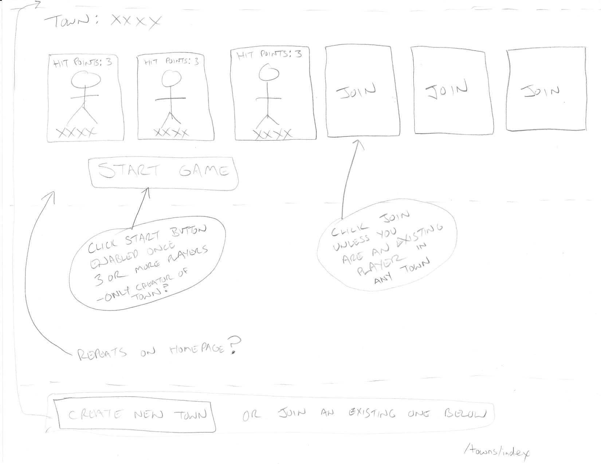
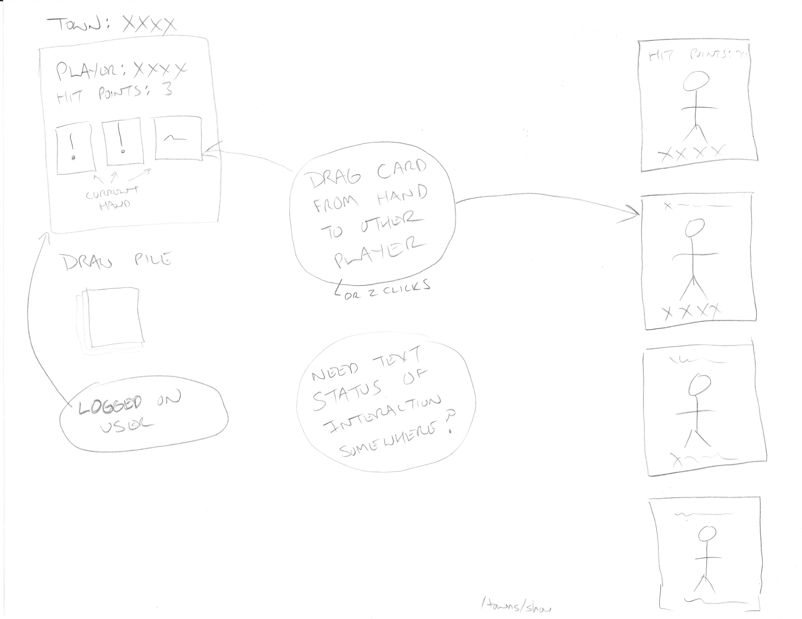

# Shootout

# Overview

Shootout is a multi-player card game.

# Notes

research: Event-Machine/thin with web-sockets - https://blog.engineyard.com/2013/getting-started-with-ruby-and-websockets 

# Application

* Homepage will present a list of games
  * Games that can be joined (have not started yet)
  * Games that cannot be joined (already in play)
  * A button to start a new game
* Once game is in play
  * See 'Simple Game' below

## Simple Game

3 or more players are required

Deal 3 cards to each player to start

Play

* play any card from your hand on another player
  * that player can optionally play a response card (if valid)
* draw a new card at end of turn

### Cards

* Bang!
* Missed

## Mockups

/towns/index

    
    

/towns/show

    
    

## More complicated version

See TODO: insert link here to pdf with rules for Bang!

* Ricochet
* Beer
  * Drink for 1 new life
* Saloon
  * Everybody drinks

## Roles / Characters

* 1 Sheriff
* Deputies
* 1 Regade
* Outlaws
